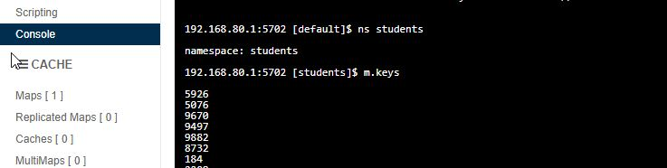

# hazelcast

**Console**





Gerer les  maps ( = m )

namespace
````shell script
192.168.80.1:5702 [default]$ ns students
namespace: students
````
keys
````shell script
192.168.80.1:5702 [students]$ m.keys
5926
5076
9670
..//..
````
value
````shell script

192.168.80.1:5702 [students]$ m.values
Ahmed5819
Ahmed3653
Ahmed9376
..//
````

size
````shell script
192.168.80.1:5702 [students]$ m.size
Size: 10000
````
